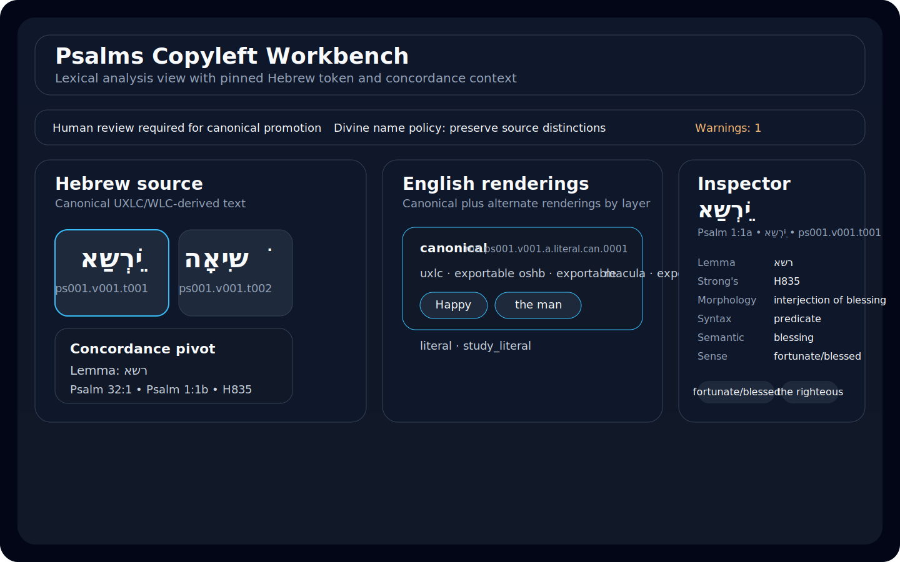
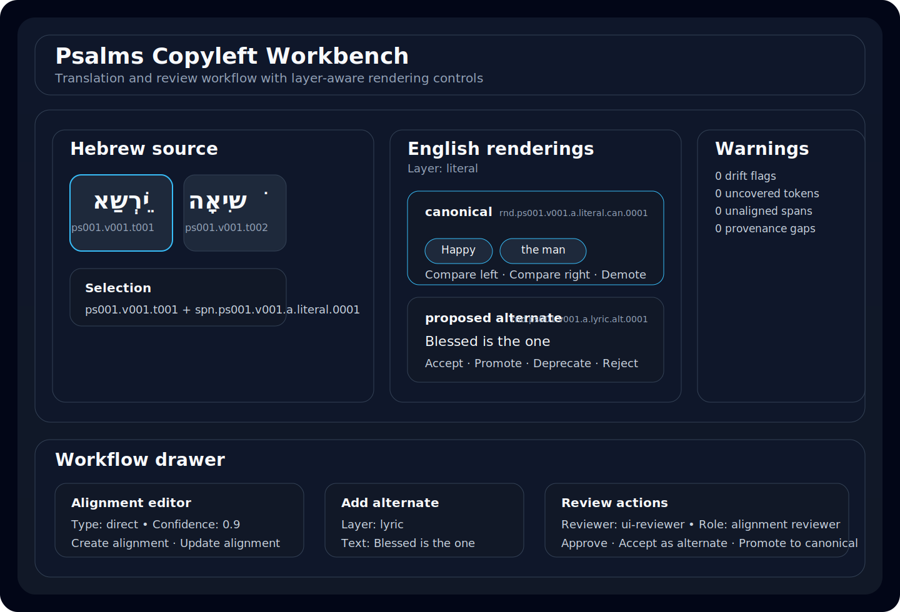

# Psalms Copyleft Workbench

Local-first workbench for Hebrew-source Psalms translation, lexical inspection, alignment, review, audit, and release packaging.

GitHub Pages welcome site: https://wirelessdreamer.github.io/AlephTav/

## What the project includes

- Git-friendly JSON content as the canonical text source of truth
- Vendored Psalms source inputs under `data/raw/` so the full Hebrew corpus rebuild works offline
- SQLite-derived indexes for concordance, lexical cards, witnesses, and jobs
- FastAPI backend plus a Typer CLI
- React + TypeScript workbench UI for lexical analysis and translation review
- Audit, provenance, review, and release-export workflows

## Quick start

Use the platform setup script from the repo root. It verifies required runtimes, installs project dependencies, runs the default full rebuild pipeline, and then starts both the FastAPI backend and the Vite UI for you.

### macOS / Linux

```bash
./setup.sh
```

### Windows PowerShell

```powershell
.\setup.ps1
```

By default the scripts:

- require Python `>=3.11`, Node.js, and npm
- create or reuse `.venv`
- install `pip install -e .[dev]`
- run `npm install`
- run the full content rebuild pipeline
- start the API on `http://127.0.0.1:8000`
- start the UI on `http://127.0.0.1:5173`

Open:

- `http://127.0.0.1:5173/` for the welcome page
- `http://127.0.0.1:5173/workbench` or `http://127.0.0.1:5173/#/workbench` for the live workbench

### Useful options

```bash
./setup.sh --fixture
./setup.sh --skip-start
./setup.sh --api-port 8010 --ui-port 5174
```

```powershell
.\setup.ps1 -DataMode fixture
.\setup.ps1 -SkipStart
.\setup.ps1 -ApiPort 8010 -UiPort 5174
```

## Full content rebuild

This is the explicit manual sequence behind the setup scripts when you want to regenerate the local project state yourself.

```bash
source .venv/bin/activate
python scripts/seed_project.py
python scripts/import_psalms.py
python scripts/build_indexes.py
python scripts/validate_content.py
python -m uvicorn app.api.main:app --reload
```

## Common commands

### CLI

```bash
psalms-workbench validate-content
psalms-workbench audit-licenses
psalms-workbench export-release --release-id v0.1.0
```

### Tests

```bash
./setup.sh --fixture --skip-start
npm test
npm run test:e2e
```

### Refresh documentation screenshots

```bash
npm run capture:screenshots
```

When Playwright can launch in your environment, this writes:

- `app/ui/public/screenshots/lexical-analysis.png`
- `app/ui/public/screenshots/translation-workflow.png`

The repo also includes committed SVG reference views used by the welcome page and GitHub-rendered docs:

- `app/ui/public/screenshots/lexical-analysis.svg`
- `app/ui/public/screenshots/translation-workflow.svg`

## What the workbench looks like

### Lexical analysis



### Translation workflow



## Documentation

- [`docs/README.md`](docs/README.md): documentation index
- [`docs/CONTRIBUTING.md`](docs/CONTRIBUTING.md): contributor workflow
- [`docs/TRANSLATION_POLICY.md`](docs/TRANSLATION_POLICY.md): canonical vs alternate policy
- [`docs/AUDIT_POLICY.md`](docs/AUDIT_POLICY.md): audit requirements and reports
- [`docs/DATA_SOURCES.md`](docs/DATA_SOURCES.md): upstream source and license policy
- [`docs/RELEASE_PROCESS.md`](docs/RELEASE_PROCESS.md): release workflow and protections

## Branch protection

The committed `.github/settings.yml` and `docs/RELEASE_PROCESS.md` capture the intended GitHub protection rules for `main`: required approvals, required CODEOWNERS review, and required passing workflows.
