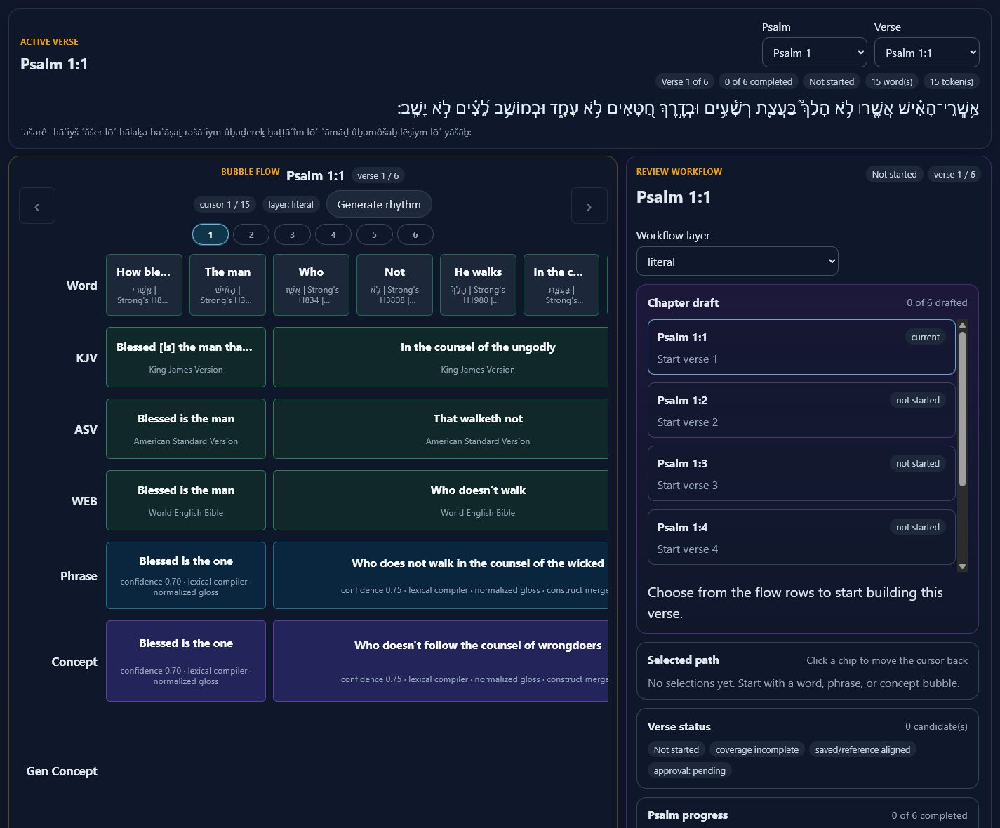
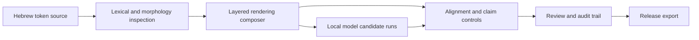

# AlephTav Visual Translation Flow Engine

Local-first Hebrew-to-English translation workbench for Psalms. AlephTav is designed around a visual translation flow: Hebrew tokens, lexical and morphology evidence, layered English renderings, alignment decisions, reviewer actions, audit state, and release export all stay visible in one reviewable workflow.

GitHub Pages welcome site: https://wirelessdreamer.github.io/AlephTav/



## Visual Translation Flow Engine

The workbench is not just a text editor or backend corpus pipeline. Its main surface is a guided translation console that lets reviewers move from Hebrew source evidence to English rendering decisions without losing provenance.


```mermaid
flowchart LR
  A["Hebrew token source"] --> B["Lexical and morphology inspection"]
  B --> C["Layered rendering composer"]
  C --> D["Alignment and claim controls"]
  D --> E["Review and audit trail"]
  E --> F["Release export"]
  C --> G["Local model candidate runs"]
  G --> D
```

- Hebrew source pane: token-level Hebrew display with hover, selection, pinning, lexical cards, Strong's data, morphology, syntax, semantic roles, glosses, and corpus usage.
- Flow composer: word, phrase, concept, lyric, metered lyric, and parallelism-aware pathways that make each translation decision visible before it becomes a verse line.
- English rendering pane: canonical and alternate renderings by layer, with span-level links back to Hebrew tokens and provenance tags for source and generator accountability.
- Guided decision rail: focused candidate comparison, word aids, concordance entry points, retrieval support nodes, and warning visibility for coverage, drift, confidence, and provenance gaps.
- Review drawer: alignment creation and editing, rendering promotion or rejection, comparison, reviewer signoff, audit notes, and release export.
- Assistant panel: conversational help with workbench context, local model profile settings, action previews, and guarded client-side actions.

The goal is not a black-box translation oracle. AlephTav is an evidence-preserving review engine where every English decision can be inspected against the Hebrew source, source policy, textual evidence, reviewer judgment, and audit state.

## What The Project Includes

- Git-friendly JSON content as the canonical text source of truth.
- Vendored Psalms source inputs under `data/raw/` so the Hebrew corpus rebuild works offline.
- SQLite-derived indexes for concordance, lexical cards, witnesses, retrieval, jobs, and review state.
- FastAPI backend, Typer CLI, and React + TypeScript visual workbench UI.
- Deterministic composer logic plus model-assisted candidate generation hooks for local and configured assistants.
- Audit, provenance, review, validation, release-export, and generated research-report workflows.

## Run The Workbench

Use the platform setup script from the repo root. It verifies required runtimes, installs dependencies, runs the default rebuild pipeline, and starts both the FastAPI backend and Vite UI.

### macOS / Linux

```bash
./setup.sh
```

### Windows PowerShell

```powershell
.\setup.ps1
```

By default the scripts:

- require Python `>=3.11`, Node.js, and npm
- create or reuse `.venv`
- install `pip install -e .[dev]`
- run `npm install`
- run the full content rebuild pipeline
- start the API on `http://127.0.0.1:43174`
- start the UI on `http://127.0.0.1:43173`

Open:

- `http://127.0.0.1:43173/` for the welcome page
- `http://127.0.0.1:43173/workbench` or `http://127.0.0.1:43173/#/workbench` for the live workbench

Useful setup options:

```bash
./setup.sh --fixture
./setup.sh --skip-start
./setup.sh --api-port 8010 --ui-port 5174
```

```powershell
.\setup.ps1 -DataMode fixture
.\setup.ps1 -SkipStart
.\setup.ps1 -ApiPort 8010 -UiPort 5174
```

## Rebuild And Validate Content

This is the explicit manual sequence behind the setup scripts when you want to regenerate local project state yourself.

```bash
source .venv/bin/activate
python scripts/seed_project.py
python scripts/import_psalms.py
python scripts/build_indexes.py
python scripts/validate_content.py
python -m uvicorn app.api.main:app --host 127.0.0.1 --port 43174 --reload
```

Common commands:

```bash
psalms-workbench validate-content
psalms-workbench audit-licenses
psalms-workbench export-release --release-id v0.1.0
npm run build
npm test
npm run test:e2e
```

## Screenshots

Refresh the generated documentation screenshots with:

```bash
npm run capture:screenshots
```

When Playwright can launch in your environment, this writes PNG views under `app/ui/public/screenshots/`. The README leads with a live workbench capture of the actual translation flow:

- `app/ui/public/screenshots/live-translation-flow.png`

The repo also includes committed SVG reference views used by the welcome page and GitHub-rendered docs:

- `app/ui/public/screenshots/translation-workflow.svg`
- `app/ui/public/screenshots/lexical-analysis.svg`

## Documentation

- [`docs/README.md`](docs/README.md): documentation index
- [`docs/CONTRIBUTING.md`](docs/CONTRIBUTING.md): contributor workflow
- [`docs/TRANSLATION_POLICY.md`](docs/TRANSLATION_POLICY.md): canonical vs alternate policy
- [`docs/AUDIT_POLICY.md`](docs/AUDIT_POLICY.md): audit requirements and reports
- [`docs/DATA_SOURCES.md`](docs/DATA_SOURCES.md): upstream source and license policy
- [`docs/RELEASE_PROCESS.md`](docs/RELEASE_PROCESS.md): release workflow and protections

## Branch Protection

The committed `.github/settings.yml` and `docs/RELEASE_PROCESS.md` capture the intended GitHub protection rules for `main`: required approvals, required CODEOWNERS review, and required passing workflows.
