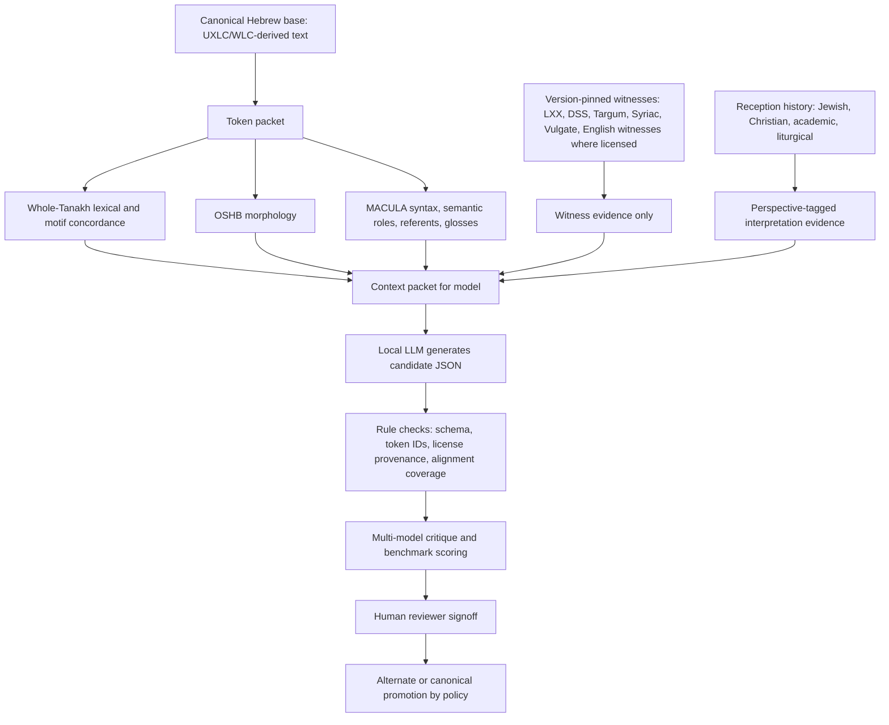
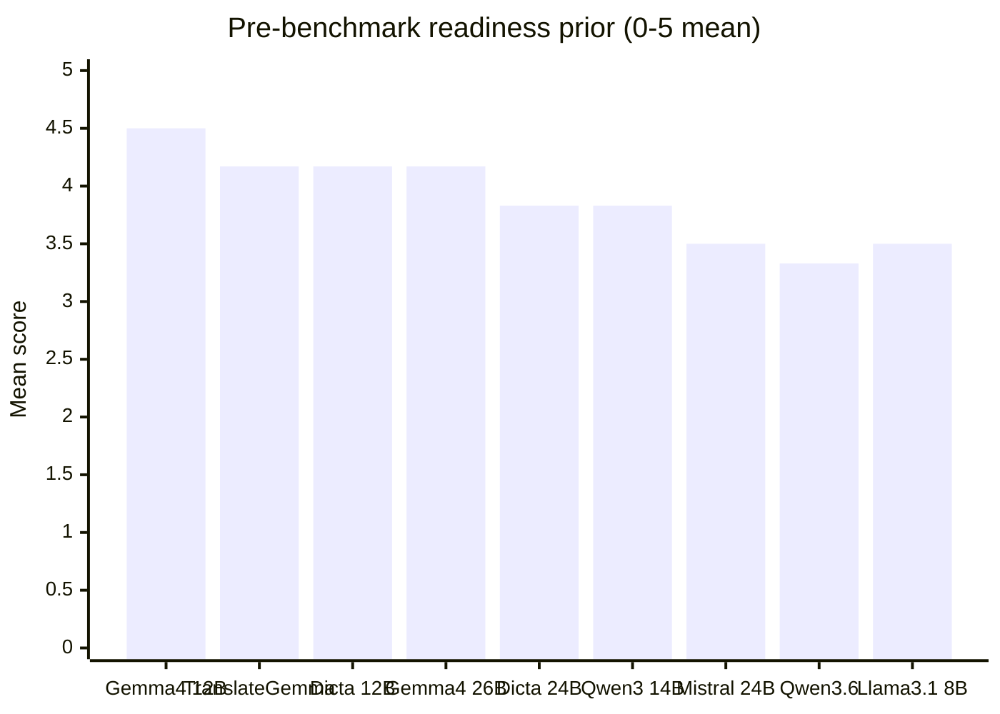
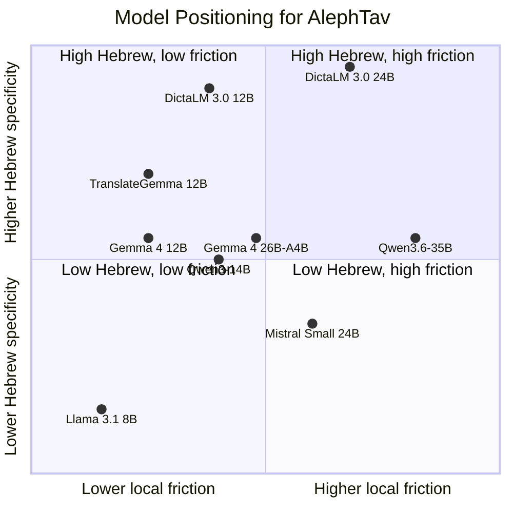
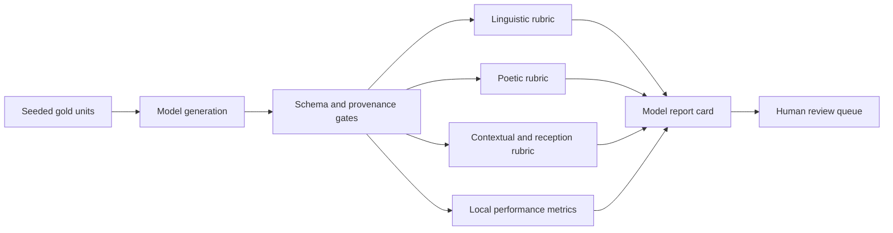
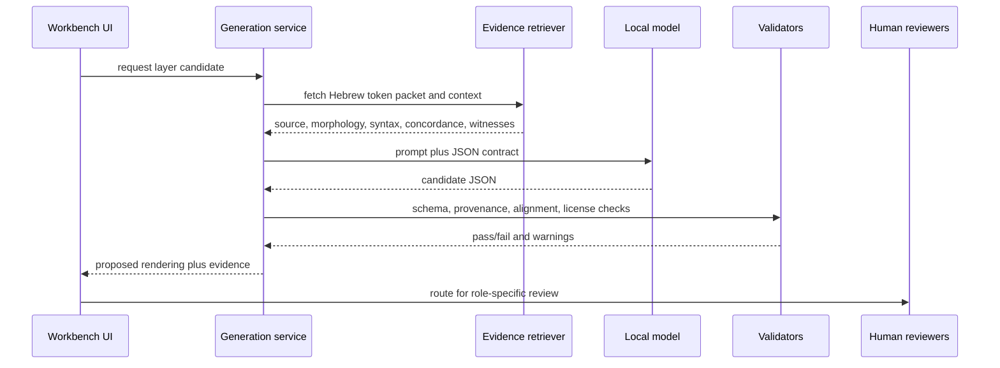

# Local Hebrew-to-English Translation Model Research Report

Date: 2026-06-15

Status: research baseline, not a benchmark result. This report records externally
verifiable facts, repo constraints, preliminary model-selection priors, and the
benchmark protocol needed before any model can be described as approved for
AlephTav translation work.

## Executive Finding

The strongest near-term path is to start with **Gemma 4 12B-it** as the first
fine-tunable local base, keep **Gemma 4 26B-A4B-it** as a stronger local
inference comparator, add **TranslateGemma 12B-it** as a translation-specialized
local comparator, and require **DictaLM 3.0** in the evaluation loop because it
is the current open-weight Hebrew-specialist family. A local LLM should not be
treated as an authority by itself. The defensible authority must come from:

1. source hierarchy and licensing discipline;
2. token-level Hebrew evidence;
3. explicit cultural, canonical, textual, and reception-history context;
4. reproducible local benchmarks;
5. human review and audit signoff.

The recommended initial implementation target is:

- Runtime: `vLLM` for structured-output bake-offs and throughput tests;
  `llama.cpp`/GGUF for single-user local fallback.
- First trainable base: `google/gemma-4-12B-it`.
- Translation-specialized comparator: `google/translategemma-12b-it`.
- Hebrew-specialist challengers: `dicta-il/DictaLM-3.0-Nemotron-12B-Instruct`
  and `dicta-il/DictaLM-3.0-24B-Thinking`.
- Multilingual challengers: `Qwen/Qwen3-14B` and, only if local memory allows,
  `Qwen/Qwen3.6-35B-A3B`.
- Repository integration point: existing adapters in `app/llm/adapters/` and
  JSON contracts in `app/llm/contracts/`.

No model should be allowed to modify canonical renderings directly. It should
generate proposed renderings, critiques, alignments, drift flags, and rationale
for review.

The integrated portfolio dashboard is generated with:

```bash
python scripts/generate_research_portfolio_dashboard.py
```

It writes `reports/research/research_portfolio_dashboard.json` and
`reports/research/research_portfolio_dashboard.html`, linking the component
dashboards and summarizing the current pipeline state from generated data.

A dedicated local model selection roadmap is generated with:

```bash
python scripts/generate_local_model_selection_roadmap.py
```

It writes `reports/research/local_model_selection_roadmap.json`,
`reports/research/local_model_selection_candidates.csv`,
`reports/research/local_model_selection_gates.csv`, and
`reports/research/local_model_selection_roadmap.html`. The current hard-data
finding is that two selection candidates are runnable through the Windows
Ollama bridge: `gemma4:26b` and the Mistral Small 3.2 GGUF. `gemma4:26b` is
the most important next repair target because it matches the Gemma direction
and has a local asset, but its current measured schema-valid rate is 0.00% on
the submitted expanded rows. Mistral Small 3.2 is the measured baseline at
100.00% schema validity on its submitted expanded rows, but it remains blocked
from scale-out by the gloss/literal layer-differentiation gate.

## Evidence Hierarchy

AlephTav already encodes the most important governance decision: canonical
translation must be source-grounded and review-controlled. A model should only
operate inside this hierarchy.



## Current Repo Constraints

These facts are from the current repository policy files.

- `docs/TRANSLATION_POLICY.md`: canonical source is UXLC/WLC-derived; OSHB and
  MACULA are enrichment; witnesses are optional, version-pinned, and separate
  from canonical source.
- `docs/REVIEW_POLICY.md`: alternate addition needs at least one qualified
  approval; canonical promotion/change needs at least two qualified approvals;
  release needs release-reviewer signoff plus audit workflows.
- `CLAUDE.md`: local adapters already exist for Ollama, vLLM, llama.cpp, and
  OpenAI-compatible runtimes under `app/llm/`.
- `app/llm/contracts/generation_output.schema.json`: model output already
  requires candidates, rationale, alignment hints, drift flags, preserved source
  images, grounding confidence, and translation basis.

The model program should therefore extend the existing workbench rather than
create a separate chatbot.

## Current Corpus Scan

A read-only scan of `content/psalms` on 2026-06-15 found:

| Measure | Value |
|---|---:|
| Psalm directories | 150 |
| Verse/unit JSON files | 2,527 |
| Token records | 19,587 |
| Units with renderings in canonical content | 0 |
| Unit status | 2,527 draft |

Implication: the first local-model benchmark should evaluate generation from
Hebrew source packets, morphology, syntax, and context. It should not pretend to
measure agreement with a complete canonical English corpus, because that corpus
does not exist yet in `content/psalms`.

A generated corpus profile is available at
`reports/research/psalms_corpus_profile.html`, with source data at
`reports/research/psalms_corpus_profile.json`. It adds the following hard-data
findings:

- Unit length is compact: min 3 tokens, max 20 tokens, mean 7.75, median 7.
- Every unit currently has witness records; the scan found 9,910 witness
  records across the 2,527 units.
- MACULA `semantic_role` and `referent` coverage is currently 0%; MACULA
  `syntax_role` coverage is 40.01%.
- OSHB `stem` coverage is 29.83%; `strong` coverage is 97.84%.
- The current compiler-feature inventory includes 8,923 multi-component tokens,
  5,002 construct-state tokens, 4,867 suffix-pronoun tokens, 4,164
  preposition-role tokens, 687 divine-name tokens, 561 discourse-marker tokens,
  and 184 temporal-pair candidates.
- The current 23-unit benchmark seed covers 197 tokens, or 0.91% of units and
  1.01% of token records.

## Model Candidate Facts

| Candidate | Relevant hard facts | Preliminary use |
|---|---|---|
| Gemma 4 12B-it | Gemma 4 is Apache 2.0, open-weight, multilingual, supports system role, structured local use, thinking modes, and 256K context for medium models according to Google model docs. | First fine-tuning base and main local generator candidate. |
| TranslateGemma 12B-it | Google released TranslateGemma in 2026 as Gemma-3-based open translation models in 4B, 12B, and 27B sizes; the 12B model is designed for consumer-laptop local development and outperforms the Gemma 3 27B baseline on WMT24++ MetricX according to Google. | Translation-fidelity comparator and possible bilingual SFT base; not a replacement for Hebrew-source/context reasoning. |
| Gemma 4 26B-A4B-it | Gemma 4 includes a 26B MoE model; Google describes A4B as active-parameter behavior, with 26B total and about 4B active per token. | Stronger local generator and critic; likely more practical for inference than training. |
| Gemma 4 31B-it | Dense 31B, highest Gemma 4 local-class quality in Google's public benchmark table, but heavier for 24GB VRAM. | Upper-bound local quality reference if quantized runtime is usable. |
| DictaLM 3.0 Nemotron 12B Instruct | DictaLM 3.0 is an open-weight Hebrew-sovereign family trained on Hebrew and English; 12B variant is Nemotron-derived. | Hebrew-specialist challenger and critic. |
| DictaLM 3.0 24B Thinking | Flagship 24B Hebrew/English reasoning model; Apache 2.0 on Hugging Face; available in quantized variants. | Hebrew-specialist high-quality comparator; likely not first 3090 fine-tune target. |
| Qwen3-14B | Qwen3 reports 119-language coverage and a 32K native context, with YaRN extension to 131K in the model card. | Multilingual challenger; useful for reasoning and translation comparison. |
| Qwen3.6-35B-A3B | Hugging Face card states OpenAI-compatible local serving via vLLM/SGLang/KTransformers and a default 262K context; vLLM examples assume multi-GPU for full length. | Stretch comparator; not a default 3090 target unless quantized and context-capped. |
| Mistral Small 3.2 24B | Mistral model card gives 128K context and now lists Small 3.2 as replaced by Small 4. Small 4 is a much larger 119B MoE-class model, so Small 3.2 remains only a legacy local 24B comparator for 3090-class tests. | Legacy structured-output and instruction-following comparator. |
| Llama 3.1 8B Instruct | Meta model card lists 128K context and eight supported languages; Hebrew is not in the supported-language list. | Local baseline only, not a serious Hebrew authority candidate. |

Current primary-source anchors checked on 2026-06-15:

- [Google Gemma 4 docs](https://ai.google.dev/gemma/docs/core): Gemma 4
  includes E2B, E4B, 12B, 31B, and 26B A4B variants.
- [Google TranslateGemma announcement](https://blog.google/innovation-and-ai/technology/developers-tools/translategemma/)
  and [TranslateGemma technical report](https://arxiv.org/abs/2601.09012):
  current translation-specialized open model evidence.
- [DictaLM 3.0 24B Thinking](https://huggingface.co/dicta-il/DictaLM-3.0-24B-Thinking)
  and [DictaLM 3.0 collection](https://huggingface.co/collections/dicta-il/dictalm-30-collection):
  current Hebrew/English specialist challenger family.
- [Qwen3-14B model card](https://huggingface.co/Qwen/Qwen3-14B) and
  [Qwen3 technical report](https://arxiv.org/html/2505.09388v1): current
  multilingual challenger evidence.
- [Mistral Small 3.2 model card](https://docs.mistral.ai/models/model-cards/mistral-small-3-2-25-06)
  and [Mistral Small 4 card](https://huggingface.co/mistralai/Mistral-Small-4-119B-2603):
  Small 3.2 is a legacy local 24B comparator; Small 4 is not the default
  3090 target.

## Preliminary Readiness Scores

These are **not measured AlephTav benchmark scores**. They are rubric priors
based on model cards, published technical reports, known repo needs, and 3090
constraints. Replace them after the bake-off harness exists.

Scoring scale: 1 = weak, 3 = usable with caveats, 5 = strong.

| Model | Local fit | Hebrew evidence | Context fit | Structured output | Fine-tune tractability | License/governance fit | Mean |
|---|---:|---:|---:|---:|---:|---:|---:|
| Gemma 4 12B-it | 5 | 3 | 5 | 5 | 4 | 5 | 4.50 |
| TranslateGemma 12B-it | 5 | 4 | 3 | 4 | 4 | 5 | 4.17 |
| DictaLM 3.0 12B Instruct | 4 | 5 | 4 | 4 | 3 | 5 | 4.17 |
| Gemma 4 26B-A4B-it | 4 | 3 | 5 | 5 | 3 | 5 | 4.17 |
| DictaLM 3.0 24B Thinking | 3 | 5 | 4 | 4 | 2 | 5 | 3.83 |
| Qwen3-14B | 4 | 3 | 4 | 4 | 4 | 4 | 3.83 |
| Mistral Small 3.2 24B | 3 | 2 | 4 | 4 | 3 | 5 | 3.50 |
| Qwen3.6-35B-A3B | 2 | 3 | 5 | 4 | 2 | 4 | 3.33 |
| Llama 3.1 8B Instruct | 5 | 1 | 4 | 3 | 5 | 3 | 3.50 |





## Why Psalms Translation Needs More Than Psalms

Psalms translation is not equivalent to generic sentence-level Hebrew-English
machine translation. A PhD-level system must expose the contextual apparatus
that a human scholar would bring to the work.

### Context layers

| Layer | Why it matters | Example evaluation question |
|---|---|---|
| Whole-Tanakh lexical context | A Hebrew lemma's sense is constrained by usage across Torah, Prophets, and Writings, not only by its occurrence in a Psalm. | Does the rendering of `hesed` preserve covenantal loyalty where the context demands it, without forcing it where the immediate phrase does not? |
| Poetic form | Psalms depend on parallelism, repetition, terseness, imagery, acrostics, and lineation. | Does the English preserve the pressure between cola instead of flattening both halves into one abstract claim? |
| Ancient Israelite cultic and royal setting | Many psalms use temple, sacrifice, kingship, refuge, enthronement, enemies, land, and covenant imagery. | Does a royal psalm preserve court/kingship language before later theological reuse is considered? |
| Textual witnesses | MT, Dead Sea Scrolls, Septuagint, Syriac, Targum, and Vulgate may preserve variants or reception history. | Is a variant being used as a witness rather than silently replacing the canonical Hebrew base? |
| Jewish and Christian reception | Some psalms have sharply different interpretive histories, especially royal and messianic psalms. | Does the rationale identify whether a reading is plain-sense, Jewish reception, Christian reception, academic-critical, or liturgical? |
| Modern target style | Gloss, literal, phrase, concept, lyric, metered lyric, and parallelism lyric have different acceptable freedoms. | Is a lyric rendering preserving source-image pressure while admitting where it has moved beyond literal form? |

### Interpretive risk examples

| Passage class | Risk | Required model behavior |
|---|---|---|
| Royal psalms such as Psalms 2 and 110 | Christian messianic readings and Jewish/historical royal readings can diverge. | Tag the interpretive frame. Do not collapse grammatical translation into theological conclusion. |
| Suffering or lament psalms | Later christological or liturgical uses may overdetermine the source text. | Translate the Hebrew scene first; list reception-history implications separately. |
| Divine names and titles | `YHWH`, `Elohim`, `Adonai`, and royal address formulas carry tradition-specific translation norms. | Preserve the source token and project naming policy in translation basis. |
| Soul/spirit/heart/body terms | Hebrew anthropology often differs from later English theological abstraction. | Prefer embodied/source-image renderings unless the layer explicitly permits abstraction. |
| Enemy and imprecation language | Sanitizing can erase genre; over-intensifying can distort tone. | Preserve complaint, petition, and justice rhetoric with drift flags for interpretive sensitivity. |
| Psalm 151 and witness boundaries | Septuagint and Dead Sea Scroll evidence demonstrate that Psalms reception extends beyond the MT 150-psalm shape. | Keep canonical scope explicit; use non-MT material only as witness/context when licensed and version-pinned. |

## Benchmark Architecture

The benchmark must test translation, interpretation, and local operational
fitness separately. Passing one does not imply passing the others.



### Required benchmark suites

| Suite | Minimum contents | Primary metrics |
|---|---|---|
| Morphology and lexeme control | stems, aspect, person/number/gender, pronominal suffixes, construct chains, particles | accuracy by feature; unsupported-claim rate |
| Syntax and discourse | verbless clauses, ellipsis, clause boundaries, waw functions, vocatives, speaker/addressee shifts | reviewer rubric; alignment coverage |
| Poetic structure | synonymous, antithetic, synthetic parallelism; acrostic; terseness; repetition | preserved-image count; lineation drift flags |
| Whole-Tanakh context | lemma concordance, motif reuse, law/prophets/writings echoes | correct cross-reference retrieval; hallucinated-reference rate |
| Textual witnesses | MT/UXLC, DSS where available, LXX, Syriac/Targum/Vulgate where licensed | witness/source separation errors; version-citation completeness |
| Jewish/Christian reception | Psalms with known divergent reception histories | perspective-tag accuracy; theological overreach rate |
| Structured output | current `generation_output.schema.json` plus alignment and provenance constraints | JSON validity; schema validity; nonexistent ID rate |
| Local operations | prompt length, output length, tokens/sec, first-token latency, VRAM, stability | measured on target 3090-class machine |
| Human review agreement | blind reviewer ranking across candidates | inter-rater agreement; accept/reject precision |

### Automatic metrics policy

Use BLEU, chrF, COMET, and related MT metrics as regression signals, not as
authority. They are useful for detecting sudden degradation against reference
renderings, but they cannot judge whether a Psalm translation preserved Hebrew
poetic pressure, avoided theological overreach, or handled textual witnesses
correctly. Human rubric scoring and alignment audits must dominate.

## Proposed Model Workflows

### Generation workflow



### Training workflow

1. Build a gold corpus from reviewed alternates and canonical renderings.
2. Convert each unit into evidence-packet prompts, not bare verse pairs.
3. Train a supervised LoRA/QLoRA adapter on schema-following and rationale
   quality.
4. Add a critic adapter trained to find lexical, alignment, cultural, and
   interpretive errors.
5. Use accepted/rejected review decisions for preference optimization only after
   the review corpus is large enough and internally consistent.
6. Freeze each release with a model card: base hash, adapter hash, data manifest,
   prompts, benchmark run, known weaknesses, and reviewer signoff.

## Data Governance

| Data source | Role | Policy |
|---|---|---|
| UXLC/WLC-derived Hebrew | Canonical source | Allowed for canonical source, display, export. |
| OSHB | Morphology and lemma enrichment | Allowed for lexical enrichment and display; preserve attribution. |
| MACULA Hebrew | Syntax, semantic role, referent, gloss enrichment | Allowed as enrichment; preserve attribution. |
| Sefaria and other witnesses | Witness and reception evidence | Version-pin and license-check each witness; never treat English witness text as source. |
| Proprietary lexicons/commentaries | Human research only unless licensed | Do not ingest into training or redistributable artifacts without explicit rights. |
| Claude/Codex/Gemini/GPT/other model critiques | Synthetic review signals | Useful for triage; not authoritative without human or rule-based validation. |

## Risk Register

| Risk | Severity | Mitigation |
|---|---|---|
| Model produces fluent theological paraphrase instead of Hebrew-grounded translation | High | Require token-aligned evidence, drift flags, and reviewer role gates. |
| Training data leaks copyrighted witness translation style | High | Maintain source manifests; license gate all training examples; reject unknown provenance. |
| Generic multilingual model underperforms on Biblical Hebrew | High | Include DictaLM and specialist linguistic benchmarks; do not rely on model-card multilingual claims. |
| Hebrew specialist model overfits modern Hebrew or rabbinic/Hebrew prose patterns | Medium | Test Biblical Hebrew morphology, poetry, and corpus-era examples separately. |
| Long context hides retrieval mistakes | Medium | Cite every source ID; score hallucinated and irrelevant references. |
| LLM-as-judge reinforces same family bias | Medium | Use model diversity plus human blind review; track judge disagreement. |
| 3090 memory constraints force low quantization and quality loss | Medium | Benchmark quantization levels separately; publish VRAM and quality trade-offs. |
| Reception-history layer collapses Jewish and Christian readings | High | Perspective-tag interpretation claims and keep translation rationale separate from reception claims. |

## Recommended Next Build Steps

1. Add a reproducible bake-off command that takes a fixed set of Psalm units and
   runs each configured local model through the same JSON contract.
2. Store raw model outputs outside canonical content, under a generated reports
   area with model hash, prompt hash, seed, quantization, runtime, and VRAM data.
3. Build an evidence retriever that supplies whole-Tanakh lemma/concept context,
   not only the current Psalm.
4. Create a 100-unit benchmark:
   - 40 routine lines,
   - 20 morphology/syntax traps,
   - 15 poetic/parallelism traps,
   - 10 textual-witness cases,
   - 10 Jewish/Christian reception cases,
   - 5 adversarial license/provenance cases.
5. Run Gemma 4 12B-it, Gemma 4 26B-A4B-it, DictaLM 3.0 12B, DictaLM 3.0 24B,
   Qwen3-14B, and Mistral Small 3.2 through the benchmark.
6. Only after the benchmark report exists, start QLoRA on Gemma 4 12B-it or
   DictaLM 3.0 12B, depending on measured Hebrew-specific performance.

An initial real-unit seed manifest is available at
[`local_translation_benchmark_seed.json`](local_translation_benchmark_seed.json).
It records the corpus scan above and 23 seed units spanning wisdom, lament,
royal/messianic reception, imprecation, Torah psalm vocabulary, textual
sensitivity, and liturgical doxology.

For a standalone visual dashboard, run:

```bash
python scripts/generate_local_model_research_report.py
```

The command reads the research JSON files and writes
`reports/research/local_translation_model_report.html` with embedded SVG charts
for model readiness, score heatmap, benchmark tag coverage, and seed-token
distribution.

For a standalone corpus-profile dashboard, run:

```bash
python scripts/generate_psalms_corpus_profile.py
```

The command scans `content/psalms` read-only and writes
`reports/research/psalms_corpus_profile.json` plus
`reports/research/psalms_corpus_profile.html` with embedded SVG charts for
Psalm token distribution, enrichment coverage, compiler-feature pressure,
part-of-speech counts, benchmark seed coverage, and expansion candidates.

For a standalone contextual-evaluation dashboard, run:

```bash
python scripts/generate_psalms_contextual_evaluation_report.py
```

The command reads
`docs/research/psalms_contextual_evaluation_rubric.json`, scans the current
Psalms content, parses the raw UXLC Tanakh archive read-only, and writes
`reports/research/psalms_contextual_evaluation.json` plus
`reports/research/psalms_contextual_evaluation.html`. The generated report
currently finds 39 canonical UXLC book XML files, 929 chapters, 23,213 verses,
and 304,223 word elements available for a future whole-Tanakh lexical index.
It also confirms that current generated content packets have 358,315 corpus
occurrence references, but those references are Psalm-only. That means a model
must not claim whole-Tanakh lexical support until a derived whole-Tanakh index is
built and wired into the evidence packet.

For a first read-only whole-Tanakh lexical profile, run:

```bash
python scripts/generate_tanakh_lexical_context_report.py
```

The command parses the raw UXLC Tanakh archive without changing `data/raw/` and
writes `reports/research/tanakh_lexical_context.json` plus
`reports/research/tanakh_lexical_context.html`. It strips pointing and
cantillation for normalized surface-form counting, so it is **form-level
evidence, not lemma or sense evidence**. The current run found 304,223 Tanakh
word elements, 39,541 normalized forms, 19,516 Psalms word elements, 6,999
distinct Psalms forms, and 4,510 distinct Psalms forms also appearing outside
Psalms. That means 64.44% of distinct Psalm forms have non-Psalms form-level
context available for a future retriever.

For a hard boundary audit between Psalm lexeme enrichment and whole-Tanakh
context evidence, run:

```bash
python scripts/generate_lexeme_context_readiness_report.py
```

The command joins current Psalm token JSON, the full UXLC Tanakh surface-form
index, and the integrated benchmark suite. It writes:

- `reports/research/lexeme_context_readiness.json`
- `reports/research/lexeme_context_readiness.csv`
- `reports/research/benchmark_lexeme_context_readiness.csv`
- `reports/research/lexeme_context_readiness.html`

The current audit finds 19,587 Psalm tokens with 97.84% Strong-ID coverage,
99.66% lemma coverage, 2,161 distinct Strong keys, 1,936 distinct lemma strings,
and 84.02% token coverage for outside-Psalms normalized surface-form context.
After regenerating against the integrated suite, it also maps 36 integrated
benchmark units and flags 26 of those units with high-risk lexical/context tags.
It records two authority blockers: there is no whole-Tanakh Strong/lemma index
in the current vendored sources, and current semantic-role/referent coverage is
0.00%. The report therefore permits outside-Psalms form evidence as retrieval
context, but not as proof of lemma identity, sense identity, or translation
authority.

For a stricter source-boundary audit of whole-Tanakh morphology availability,
run:

```bash
python scripts/generate_whole_tanakh_morphology_gap_report.py
```

The command reads the current Psalm token JSON, the UXLC Tanakh archive, the
Psalm-scoped OSHB and MACULA sources, and the contextual expanded benchmark
suite. It
writes:

- `reports/research/whole_tanakh_morphology_gap.json`
- `reports/research/whole_tanakh_morphology_gap_sources.csv`
- `reports/research/whole_tanakh_morphology_gap_lexemes.csv`
- `reports/research/whole_tanakh_morphology_gap_units.csv`
- `reports/research/whole_tanakh_morphology_gap.html`

The current run finds 39 UXLC books and 304,223 Hebrew word elements, but 0 UXLC
word elements with lemma, Strong, or morphology attributes. Local Hebrew
morphology is available for Psalms only: 1 book with morphology, 0 non-Psalm
books with morphology, and 0.00% outside-Psalms Strong-context token coverage.
Across the 56-unit expanded benchmark scope, 46 units carry high-risk tags. The
top morphology-boundary pressure key is `H3068`, which is expected because
divine-name handling is central to Psalms translation and requires evidence
beyond surface-form matching.

For a unit-level claim-control matrix that joins Hebrew, culture, witness,
whole-Tanakh, morphology, and reception evidence, run:

```bash
python scripts/generate_translation_claim_evidence_matrix.py
```

The command joins the contextual expanded benchmark suite, contextual pressure
atlas, reception boundary ledger, canonical context network, morphology-gap
audit, witness audit, and expanded review plan. It writes:

- `reports/research/translation_claim_evidence_matrix.json`
- `reports/research/translation_claim_evidence_matrix_units.csv`
- `reports/research/translation_claim_evidence_matrix_controls.csv`
- `reports/research/translation_claim_evidence_matrix.html`

The current matrix covers 56 expanded benchmark units. It marks 52 units as
high claim-risk, 23 as reception-sensitive, 15 as requiring Jewish/Christian
separation, 39 as requiring ancient-cultural setting controls, and 43 as
textual-witness-pressure units. It also records 100.00% complete expected
witness coverage for these units while keeping outside-Psalms Strong support at
0.00%. The matrix is the reviewer-facing guardrail for keeping reception,
culture, textual witnesses, and surface-form Tanakh context out of the
translation text unless they are explicitly labeled and reviewed.

For a benchmark-unit canonical context network, run:

```bash
python scripts/generate_canonical_context_network_report.py
```

The command joins the contextual expanded benchmark suite, Psalm token JSON,
the contextual pressure atlas, and the read-only UXLC Tanakh archive. It writes:

- `reports/research/canonical_context_network.json`
- `reports/research/canonical_context_unit_network.csv`
- `reports/research/canonical_context_domain_network.csv`
- `reports/research/canonical_context_book_network.csv`
- `reports/research/canonical_context_network.html`

The current run uses UXLC 2.5, dated 1 Apr 2026, build 27.6. It maps all 56
expanded benchmark units, 586 source tokens, and 357 content tokens. Across
those units, 88.40% of tokens have outside-Psalms normalized surface-form
evidence, 96.59% have outside-Psalms lemma-form string evidence, and 89.64% of
content tokens have outside-Psalms surface evidence. All 56 units have at least
one high-value content-token anchor, and 100.00% have surface evidence in at
least three non-Psalm Tanakh divisions. This strengthens the cross-canon review
apparatus, but it remains retrieval evidence only; the report still marks the
whole-Tanakh lemma/sense index as unavailable and flags 53 units for reviewer
attention because high retrieval coverage can still hide high-frequency-form,
intertextual, witness, or reception-boundary risks.

For a witness and reception-history readiness audit, run:

```bash
python scripts/generate_witness_reception_readiness_report.py
```

The command scans Psalm unit witness records, raw source manifests, the
contextual pressure atlas, and the integrated benchmark suite. It writes:

- `reports/research/witness_reception_readiness.json`
- `reports/research/witness_reception_units.csv`
- `reports/research/reception_frame_routing.csv`
- `reports/research/witness_reception_readiness.html`

The current audit finds 9,910 witness rows across all 2,527 Psalm units: LXX
Greek witness rows cover 100.00% of units, while public-domain English witness
rows cover 97.39%. The 100-unit atlas has 15 reception-sensitive units and 62
textual-witness/provenance-pressure units; the integrated 36-unit benchmark has
17 units carrying reception tags and 10 carrying textual-witness tags. The
source-policy table also records that KJV, ASV, and WEB are used witness sources
but are not allowed for generation in the current manifest policy, so they remain
comparison evidence rather than training or generation source text.

For a reception and interpretation boundary ledger, run:

```bash
python scripts/generate_reception_interpretation_boundary_report.py
```

The command joins the contextual expanded benchmark suite, the contextual
pressure atlas, Psalm witness records, the canonical context network, the
expanded review plan, and the contextual-evaluation rubric. It writes:

- `reports/research/reception_interpretation_boundary.json`
- `reports/research/reception_interpretation_boundary_units.csv`
- `reports/research/reception_interpretation_boundary_frames.csv`
- `reports/research/reception_interpretation_boundary.html`

The current boundary ledger maps all 56 expanded benchmark units into claim
lanes. It records 23 reception-sensitive units, 43 textual-witness-pressure
units, 39 ancient-culture-pressure units, and 53 theology-pressure units. All 56
expanded units have a complete witness set for this audit: LXX plus three
public-domain English witnesses. Fifteen units require both Jewish and Christian
reception frames plus an academic comparison frame. The report also marks 23
units where reception claims must be kept out of translation text, and it
assigns a boundary-risk average of 52.41 with 8 high-risk units. The top
boundary-risk unit is currently `ps002.v007.a`, because royal sonship,
intertextual, Jewish/Christian reception, textual-witness, and theology controls
all converge there.

For generated seed-unit context packets, run:

```bash
python scripts/generate_psalms_seed_context_packets.py
```

The command joins the benchmark seed manifest, current Psalm unit JSON, the
contextual rubric, and the raw UXLC archive into
`reports/research/psalms_seed_context_packets.json` plus
`reports/research/psalms_seed_context_packets.html`. The current run creates
packets for all 23 seed units and 197 seed tokens. All 197 seed tokens match a
normalized UXLC surface form, and 160 seed tokens, or 81.22%, have surface-form
matches outside Psalms. This is a concrete prototype of the future evidence
packet, but it remains form-level retrieval: it must not be treated as
lemma-aware sense evidence.

For a generated local model benchmark suite, run:

```bash
python scripts/generate_local_model_benchmark_suite.py
```

The command reads the seed context packets and current
`app/llm/contracts/generation_output.schema.json`, then writes:

- `reports/research/local_model_benchmark_suite.json`
- `reports/research/local_model_benchmark_tasks.jsonl`
- `reports/research/local_model_benchmark_suite.html`

The current suite contains 46 tasks: 23 gloss tasks and 23 literal tasks over
the 23 seed units. It counts 394 token instances because each unit is tested in
two layers. With the seven recommended bake-off models, the first full run would
produce 322 model-task runs before human review. Each JSONL task includes a
schema-shaped `generation_input`, the required output schema path, seed/context
evidence, and a weighted rubric covering token alignment, lexical morphology,
source-image poetics, whole-Tanakh context, witness boundaries, reception
separation, style-layer compliance, unsupported-claim control, and local runtime
metadata.

For a deterministic 100-unit benchmark expansion plan, run:

```bash
python scripts/generate_benchmark_expansion_plan.py
```

The command keeps all 23 current seed units fixed and fills the published
100-unit target strata with 77 generated expansion candidates from current
corpus evidence. It writes:

- `reports/research/benchmark_100_expansion_plan.json`
- `reports/research/benchmark_100_expansion_plan.csv`
- `reports/research/benchmark_100_expansion_plan.html`

The current plan contains 40 routine lines, 20 morphology/syntax traps, 15
poetic/parallelism traps, 10 textual-witness cases, 10 Jewish/Christian
reception cases, and 5 license/provenance adversarial cases. The generated
HTML report includes charts for stratum counts, seed-vs-expansion source
counts, and token-count buckets. These are curation candidates, not reviewed
gold units.

For a benchmark-level context and reception matrix, run:

```bash
python scripts/generate_benchmark_context_reception_matrix.py
```

The command reads the 100-unit expansion plan, current Psalm unit JSON, the
contextual rubric, and the raw UXLC archive read-only. It writes:

- `reports/research/benchmark_context_reception_matrix.json`
- `reports/research/benchmark_context_reception_matrix.csv`
- `reports/research/benchmark_context_reception_matrix.html`

The current matrix analyzes 100 units and 971 Hebrew tokens. It finds 968
normalized surface-form matches in the UXLC archive, and 858 tokens, or
88.36%, have non-Psalms normalized surface-form context. It routes 27 units as
high context pressure, 49 as medium, and 24 as standard. It flags 15 units for
Jewish/Christian reception-history review and 62 units for textual-witness or
provenance pressure. These flags are heuristic review-routing evidence, not
expert interpretation or approved translation judgment.

For a contextual pressure atlas over the 100-unit benchmark, run:

```bash
python scripts/generate_contextual_pressure_atlas.py
```

The command reads the context/reception matrix and contextual rubric, then
writes:

- `reports/research/contextual_pressure_atlas.json`
- `reports/research/contextual_pressure_priority_units.csv`
- `reports/research/contextual_pressure_atlas.html`

The atlas groups the benchmark into Hebrew source control, whole-Tanakh
canonical context, ancient cultural setting, textual witness/provenance, and
Jewish/Christian reception-boundary axes. The current atlas finds 90 of 100
units with ancient-context domain pressure, 98 units with outside-Psalms form
context in all five tracked Tanakh divisions, 15 reception-sensitive units,
62 textual-witness/provenance units, and 51 priority review-stack units. The
top-priority unit is `ps022.v028.a`, because multiple domains overlap:
anthropology/body, covenant mercy, creation/cosmos, divine names, reception,
lament/enemy/justice, nations/Zion/exile, and textual witness pressure.
These are hard routing counts from project data, not claims that the listed
interpretive frames are correct.

For reviewer-ready priority unit dossiers, run:

```bash
python scripts/generate_priority_unit_dossiers.py
```

The command selects the top priority units from the contextual pressure atlas,
joins the matrix, current unit JSON, benchmark-suite coverage, and
cross-examination packet coverage, then writes:

- `reports/research/priority_unit_dossiers.json`
- `reports/research/priority_unit_dossiers.jsonl`
- `reports/research/priority_unit_dossier_index.csv`
- `reports/research/priority_unit_dossiers.html`

The current dossier report covers the top 25 priority units, 283 source-token
records, 25 high-pressure units, 13 Jewish/Christian reception-sensitive units,
and 18 textual-witness/provenance units. It also exposes an important benchmark
gap: 13 of the 25 highest-priority dossiers do not yet have generated gloss and
literal benchmark tasks or advisory model cross-exam packets. These dossiers
are the first reviewer-facing packet set where Hebrew tokens, witnesses,
outside-Psalms form context, cultural/reception domains, review questions, and
decision gates are visible together.

For a supplemental benchmark suite that closes those priority dossier task
gaps, run:

```bash
python scripts/generate_priority_benchmark_supplement.py
python scripts/generate_model_cross_exam_protocol.py \
  --suite reports/research/priority_benchmark_supplement_suite.json \
  --json-output reports/research/priority_benchmark_supplement_cross_exam_protocol.json \
  --jsonl-output reports/research/priority_benchmark_supplement_cross_exam_packets.jsonl \
  --csv-output reports/research/priority_benchmark_supplement_cross_exam_execution_matrix.csv \
  --html-output reports/research/priority_benchmark_supplement_cross_exam_protocol.html
```

The supplement writes:

- `reports/research/priority_benchmark_supplement_suite.json`
- `reports/research/priority_benchmark_supplement_tasks.jsonl`
- `reports/research/priority_benchmark_supplement_suite.html`
- `reports/research/priority_benchmark_supplement_cross_exam_protocol.json`
- `reports/research/priority_benchmark_supplement_cross_exam_packets.jsonl`
- `reports/research/priority_benchmark_supplement_cross_exam_execution_matrix.csv`
- `reports/research/priority_benchmark_supplement_cross_exam_protocol.html`

The current supplement closes all 13 dossier task gaps with 26 gloss/literal
tasks, 326 token instances, and 182 planned model-task runs across the seven
planned bake-off models. Its matching advisory cross-exam protocol adds 78
judge packets, 1,638 model/candidate/judge execution rows, and 1,464 probe
questions. A dry-run validation over the supplement currently submits 4
placeholder rows and all 4 are schema-valid; no real model quality is implied.

For the integrated runnable benchmark target, run:

```bash
python scripts/generate_integrated_benchmark_suite.py
python scripts/generate_model_cross_exam_protocol.py \
  --suite reports/research/integrated_benchmark_suite.json \
  --json-output reports/research/integrated_benchmark_cross_exam_protocol.json \
  --jsonl-output reports/research/integrated_benchmark_cross_exam_packets.jsonl \
  --csv-output reports/research/integrated_benchmark_cross_exam_execution_matrix.csv \
  --html-output reports/research/integrated_benchmark_cross_exam_protocol.html
python scripts/run_local_model_benchmark_suite.py \
  --suite reports/research/integrated_benchmark_suite.json \
  --dry-run \
  --limit 4 \
  --output reports/research/integrated_benchmark_dry_run_results.jsonl
python scripts/score_local_model_benchmark_results.py \
  --suite reports/research/integrated_benchmark_suite.json \
  --results reports/research/integrated_benchmark_dry_run_results.jsonl \
  --json-output reports/research/integrated_benchmark_dry_run_audit.json \
  --html-output reports/research/integrated_benchmark_dry_run_audit.html
python scripts/score_local_model_benchmark_results.py \
  --suite reports/research/integrated_benchmark_suite.json \
  --results reports/research/integrated_benchmark_results.jsonl \
  --json-output reports/research/integrated_benchmark_result_audit.json \
  --html-output reports/research/integrated_benchmark_result_audit.html
python scripts/generate_review_signoff_plan.py \
  --suite reports/research/integrated_benchmark_suite.json \
  --audit reports/research/integrated_benchmark_result_audit.json \
  --json-output reports/research/integrated_review_signoff_plan.json \
  --csv-output reports/research/integrated_review_signoff_template.csv \
  --html-output reports/research/integrated_review_signoff_plan.html
```

The integrated suite merges the original seed benchmark and the priority
supplement without duplicate task IDs. It currently contains 72 runnable
gloss/literal tasks across 36 Psalm units, 720 token instances, and 504 planned
model-task runs across the seven planned bake-off models. The integrated advisory
cross-exam protocol contains 216 judge packets, 4,536 model/candidate/judge
execution rows, and 3,798 probe questions. The integrated dry-run audit
currently submits 4 placeholder rows and all 4 are schema-valid and known-task
valid. In this workspace, `reports/research/integrated_benchmark_results.jsonl`
now contains 36 real Windows Ollama rows: 34 are schema-valid, 468 expected
model-task rows are still missing, and 0 source-anchor issues are flagged. The
integrated review signoff plan projects 1,512 candidate outputs, 6,342
role-specific human review rows, and 4,536 advisory model critique rows. The
planned-model grid still requires broad real local model execution and human
review before any model can be treated as approved.

For coverage analysis against the full 100-unit contextual atlas, run:

```bash
python scripts/generate_contextual_benchmark_coverage_report.py
```

The command compares the contextual pressure atlas, integrated benchmark suite,
and top-priority dossiers. It writes:

- `reports/research/contextual_benchmark_coverage.json`
- `reports/research/contextual_benchmark_coverage_units.csv`
- `reports/research/contextual_benchmark_coverage_domains.csv`
- `reports/research/contextual_benchmark_next_units.csv`
- `reports/research/contextual_benchmark_coverage.html`

The current integrated benchmark covers 36 of the 100 atlas units, so 64 atlas
units still lack runnable gloss/literal tasks. Coverage is intentionally
front-loaded toward high-risk work: it covers all 27 high-pressure atlas units
and all 25 top-priority dossier units. Remaining breadth gaps are still
material: reception-sensitive coverage is 14 of 15 units, while textual-witness
or provenance-pressure coverage is 25 of 62 units. The highest-scored next unit
for another supplement is currently `ps147.v006.a`, because it combines
creation, divine-name, lament/justice, nations/Zion, textual-witness, and
wisdom/Torah pressure.

For a contextual gap benchmark supplement that turns the top uncovered atlas
units into runnable gloss/literal tasks, run:

```bash
python scripts/generate_contextual_gap_benchmark_supplement.py
python scripts/generate_model_cross_exam_protocol.py \
  --suite reports/research/contextual_gap_benchmark_supplement_suite.json \
  --json-output reports/research/contextual_gap_benchmark_supplement_cross_exam_protocol.json \
  --jsonl-output reports/research/contextual_gap_benchmark_supplement_cross_exam_packets.jsonl \
  --csv-output reports/research/contextual_gap_benchmark_supplement_cross_exam_execution_matrix.csv \
  --html-output reports/research/contextual_gap_benchmark_supplement_cross_exam_protocol.html
```

The current contextual gap supplement selects the top 20 uncovered atlas units
and creates 40 runnable tasks, 452 token instances, and 280 planned model-task
runs. It closes 20 of the 64 uncovered atlas units, raising projected atlas
coverage from 36% to 56% after merge. The selected set contains 18
textual-witness/provenance units and 1 reception-sensitive unit. Its advisory
cross-exam protocol contains 120 judge packets and 2,520 execution rows; the
dry-run audit submits 4 placeholder rows and all 4 are schema-valid.

For the broadest generated benchmark target, run:

```bash
python scripts/generate_contextual_expanded_benchmark_suite.py
python scripts/generate_model_cross_exam_protocol.py \
  --suite reports/research/contextual_expanded_benchmark_suite.json \
  --json-output reports/research/contextual_expanded_benchmark_cross_exam_protocol.json \
  --jsonl-output reports/research/contextual_expanded_benchmark_cross_exam_packets.jsonl \
  --csv-output reports/research/contextual_expanded_benchmark_cross_exam_execution_matrix.csv \
  --html-output reports/research/contextual_expanded_benchmark_cross_exam_protocol.html
python scripts/score_local_model_benchmark_results.py \
  --suite reports/research/contextual_expanded_benchmark_suite.json \
  --results reports/research/contextual_expanded_benchmark_results.jsonl \
  --json-output reports/research/contextual_expanded_benchmark_result_audit.json \
  --html-output reports/research/contextual_expanded_benchmark_result_audit.html
```

The contextual expanded suite merges the 72-task integrated suite with the
40-task contextual gap supplement. It currently contains 112 runnable tasks,
56 Psalm units, 1,172 token instances, and 784 planned model-task runs. Its
advisory cross-exam protocol contains 336 judge packets and 7,056 execution
rows. A four-row dry-run audit is schema-valid, and the expanded review signoff
plan projects 2,352 candidate outputs, 9,324 role-specific human review rows,
and 7,056 advisory model critique rows. The expanded real-result audit currently
scores `reports/research/contextual_expanded_benchmark_results.jsonl`, which is
a superset of the integrated result stream plus expanded-only rows. It records
40 of 784 expected model-task rows submitted, 38 schema-valid rows, 744 missing
rows, and 0 source-anchor issues. The integrated result audit still scores
`reports/research/integrated_benchmark_results.jsonl` separately, so
expanded-only rows do not appear as unexpected integrated-suite submissions.

For a crosswalk between high-risk claim controls and the real local-model
evidence actually submitted so far, run:

```bash
python scripts/generate_model_evidence_gap_report.py
```

The command joins the contextual expanded benchmark suite, contextual expanded
real-result audit, and translation claim evidence matrix. It writes:

- `reports/research/model_evidence_gap_report.json`
- `reports/research/model_evidence_gap_units.csv`
- `reports/research/model_evidence_gap_models.csv`
- `reports/research/model_evidence_gap_domains.csv`
- `reports/research/model_evidence_gap_controls.csv`
- `reports/research/model_evidence_gap_report.html`

The current gap report scores 40 submitted expanded-result rows out of 784
expected model-task rows. Thirty-eight are schema-valid, so the schema-valid
share of the full planned expanded grid is 4.85%. Nineteen of 56 expanded units
have at least one schema-valid real local-model row; 37 units have none. Among
the 52 high-risk claim-control units, 34 still have no schema-valid real output.
Reception-sensitive gaps remain on 7 units, Jewish/Christian separation gaps
on 4 units, textual-witness gaps on 31 units, and ancient-culture gaps on 22
units. The top overall remaining gap is currently `ps022.v028.a`, because it has
partial local evidence but still lacks most planned model coverage. The top unit
with no real local-model evidence is now `ps127.v001.a`.

For a first-pass quality triage over the actual model output text, run:

```bash
python scripts/generate_model_output_quality_triage_report.py
```

The command joins the contextual expanded suite, contextual expanded real-result
stream, expanded result audit, and translation claim evidence matrix. It writes:

- `reports/research/model_output_quality_triage.json`
- `reports/research/model_output_quality_triage_candidates.csv`
- `reports/research/model_output_quality_triage_models.csv`
- `reports/research/model_output_quality_triage_flags.csv`
- `reports/research/model_output_quality_triage_domains.csv`
- `reports/research/model_output_quality_triage.html`

The current triage report analyzes 40 candidate rows. Thirty-eight rows are
schema-valid and therefore eligible for text-level triage; 2 Gemma 4 26B rows
are structure failures and are not treated as translation candidates. Among the
valid rows, 36 carry contextual review flags because the benchmark is heavily
weighted toward high-risk units. The mean heuristic review-priority score is
47.98, and valid rows have a mean source-gloss keyword gap of 5.14%. Mistral
Small 3.2 is 38/38 schema-valid in the expanded stream with a mean triage score
of 45.24; Gemma 4 26B is 0/2 schema-valid in the expanded stream and remains a
structured-output blocker. The most common flags are high claim risk, ancient
culture pressure, reception-boundary review, textual-witness review, and divine
name policy review. This triage is deliberately a review-routing layer, not a
claim of Hebrew accuracy or publishable translation quality.

For a paired gloss/literal layer-contract audit over real local model outputs,
run:

```bash
python scripts/generate_layer_consistency_report.py
```

The command joins the contextual expanded suite, contextual expanded result
stream, expanded result audit, and translation claim evidence matrix. It writes:

- `reports/research/layer_consistency_report.json`
- `reports/research/layer_consistency_pairs.csv`
- `reports/research/layer_consistency_models.csv`
- `reports/research/layer_consistency_flags.csv`
- `reports/research/layer_consistency_report.html`

The current layer audit finds 19 paired unit/model rows with both gloss and
literal outputs, all schema-valid. It flags 9 exact gloss/literal duplicates, 4
near duplicates, and 14 weak layer-differentiation pairs. Mean word-set overlap
between paired gloss and literal outputs is 91.54%, while literal outputs are
only 0.16 words longer on average. Fourteen pairs involve source divine-name
tokens, and 2 paired outputs differ in visible divine-name rendering. The top
layer-risk row is `ps018.v007.a` / Psalm 18:7 at a heuristic risk score of
100.00. This is not a correctness score; it proves that the present real local
output stream is not yet reliably honoring the repository's layered rendering
contract.

For a remediation action matrix and retry queue based on those measured layer
failures, run:

```bash
python scripts/generate_layer_remediation_plan.py
```

The command joins the layer-consistency audit, model-output quality triage,
structured-output tuning report, model-evidence gap report, prompt files, and
benchmark runners. It writes:

- `reports/research/layer_remediation_plan.json`
- `reports/research/layer_remediation_actions.csv`
- `reports/research/layer_remediation_retry_tasks.csv`
- `reports/research/layer_remediation_plan.html`

The current remediation plan defines 6 actions: 1 critical layer-contract action,
4 high-severity actions, and 1 medium-severity prompt-density action. It creates
36 retry task rows across 18 paired unit/model rows. The top retry row is
`bench.ps002.v007.a.gloss` / Psalm 2:7. The plan confirms that the benchmark
runners now contain explicit layer contracts and distinct gloss/literal
differentiators, but it treats that as source-control state only. It is not
model-quality evidence until the retry queue is rerun, rescored, and audited
against the layer-consistency report.

For a post-remediation paired retry experiment, run:

```bash
python scripts/generate_layer_remediation_experiment_report.py
```

The command compares the original layer-consistency audit with two separate
Psalm 2:7 retry streams plus a third grammatical-literal retry:

- `reports/research/layer_remediation_retry_results.jsonl`
- `reports/research/layer_remediation_retry_v2_results.jsonl`
- `reports/research/layer_remediation_retry_v3_results.jsonl`

It writes:

- `reports/research/layer_remediation_experiment_report.json`
- `reports/research/layer_remediation_experiment_attempts.csv`
- `reports/research/layer_remediation_experiment_gates.csv`
- `reports/research/layer_remediation_experiment_report.html`

The current experiment is a partial improvement, not a pass. The best attempt,
`Retry v3 Grammatical Literal`, is 2/2 schema-valid with 0 source-anchor issues,
0 exact gloss/literal duplicates, 0 near-duplicate pairs, 0 visible divine-name
inconsistencies, a pipe-separated gloss marker, and a grammatical literal line.
It reduces the Psalm 2:7 pair from 100.00% baseline word overlap to 80.95%.
However, it still has 1 weak-differentiation pair. The failed gate is therefore
`weak_layer_differentiation`, so the full 36-row retry queue should not be run
as proof of remediation until the single-pair probe passes that gate.

For a gate-level audit of whether the research portfolio is ready to make
authoritative translation claims, run:

```bash
python scripts/generate_scholarly_authority_readiness_report.py
```

The command joins the corpus profile, lexeme readiness audit, canonical context
network, witness/reception audit, reception boundary ledger, contextual atlas
coverage, expanded benchmark suite, cross-exam protocol, review plan,
real-result audits, model-evidence gap report, output-quality triage, layer
consistency audit, layer remediation plan, layer remediation experiment, runtime
readiness, asset inventory, and portfolio dashboard.
It writes:

- `reports/research/scholarly_authority_readiness.json`
- `reports/research/scholarly_authority_gate_rows.csv`
- `reports/research/scholarly_authority_risk_register.csv`
- `reports/research/scholarly_authority_domain_coverage.csv`
- `reports/research/scholarly_authority_readiness.html`

The current authority audit gives the portfolio a 65.55% weighted readiness
score with two hard blockers: `human_signoff` and `release_authority`. The
`real_model_evidence` gate is no longer zero because the Windows Ollama bridge
has produced real integrated benchmark rows, but the evidence remains thin:
36 of 504 integrated model-task rows are submitted, 34 are schema-valid, and 0
source-anchor issues are flagged after the Windows bridge UTF-8 fix. The real
evidence gate now also uses the model-evidence gap report and the output-quality
triage report, so it records that 37 of 56 expanded units still lack
schema-valid real local output, 34 high-risk units remain without valid rows,
38 of 40 candidate rows are eligible for text triage, and the layer audit has 9
exact gloss/literal duplicates plus 14 weak differentiation pairs. The
remediation plan contributes 36 retry tasks and records that runner layer
contracts are present. A post-remediation Psalm 2:7 experiment now proves schema
validity, source anchoring, exact-duplicate removal, and a structural gloss
marker, but it still fails weak layer differentiation at 80.95% word overlap. The
whole-Tanakh context gate is now 65.38% and `prototype`: the canonical context
network supplies cross-canon surface evidence for all 56 expanded units, but the
morphology-gap audit finds 0 non-Psalm books with local Hebrew morphology and
0.00% outside-Psalms Strong-context token coverage. The witness/reception gate is
90.53% because witness coverage and reception boundary controls are explicit, but
the gate still treats English witnesses as evidence, not generation basis. The
translation claim matrix adds 52 high-risk claim-control rows and 15 units
requiring Jewish/Christian separation, so the reception and culture controls are
generated but not signed off. The
weakest remaining domain is currently `wisdom_torah` at 50.00% projected
expanded coverage, while Jewish/Christian reception reaches 100.00% projected
coverage in the 100-unit atlas. The report intentionally refuses to call any
model authoritative while full real local benchmark coverage, completed human
signoff, and canonical rendering promotion evidence are absent.

For running benchmark tasks against a local model endpoint, use:

```bash
python scripts/run_local_model_benchmark_suite.py \
  --model-profile docs/research/local_model_profile_template.json \
  --limit 1
```

The profile template at `docs/research/local_model_profile_template.json` shows
the expected adapter fields without secrets. Copy it before adding local
endpoint details. The runner writes result JSONL rows containing `task_id`,
`model_profile_id`, `output`, and runtime metadata. It supports the existing
`app/llm` adapters and writes to
`reports/research/local_model_benchmark_results.jsonl` by default for real model
runs.

For the current Windows Ollama bridge smoke sample, the seed command shape is:

```bash
python scripts/run_windows_ollama_benchmark_suite.py \
  --suite reports/research/integrated_benchmark_suite.json \
  --output reports/research/integrated_benchmark_results.jsonl \
  --model hf.co/unsloth/Mistral-Small-3.2-24B-Instruct-2506-GGUF:UD-Q4_K_XL \
  --model-profile-id mistralai/Mistral-Small-3.2-24B-Instruct-2506 \
  --task-id bench.ps013.v001.a.gloss \
  --prompt-mode compact \
  --format-mode schema \
  --candidate-count 1 \
  --max-tokens 900 \
  --timeout-seconds 300
```

The current integrated result file contains 36 Windows Ollama rows: 34 Mistral
Small 3.2 rows and two malformed Gemma 4 26B rows on `ps013.v001.a` and
`ps022.v028.a`. Thirty-four rows are schema-valid. The high-risk Mistral batches
added valid rows for
`ps022.v028.a`, `ps110.v003.a`, `ps110.v001.a`, and, after retrying with a
larger generation cap, `ps018.v001.a`; a later focused batch added valid rows
for `ps002.v007.a`, `ps110.v004.a`, `ps018.v007.a`, `ps022.v017.a`,
`ps002.v012.a`, `ps069.v014.a`, `ps069.v017.a`, `ps008.v002.a`, and
`ps096.v013.a`; the latest integrated batch added `ps103.v022.a` and
`ps022.v024.a`. The expanded-only stream also has valid Mistral rows for
`ps027.v004.a`. The valid rows have automated alignment and translation-basis
means of 5.00/5.00, 0 invalid token references, and 0 source-anchor issues. The
latest Gemma 26B comparator attempt on `ps022.v028.a` began with the correct
JSON shape and a plausible rendering, but corrupted token IDs and ended
mid-string, so it is counted as a structured-output failure rather than a valid
translation candidate. The
earlier question-mark corruption in
`source_anchor.source_text` was traced to the Windows Ollama bridge transport;
the bridge now forces UTF-8 input/output and `application/json; charset=utf-8`.
This is useful gate evidence: schema validity and token alignment are not enough
unless the Hebrew source image survives transport unchanged, and longer
superscription rows need enough generation budget to close structured JSON.

For pipeline validation without calling a model, run:

```bash
python scripts/run_local_model_benchmark_suite.py --dry-run --limit 4
python scripts/score_local_model_benchmark_results.py \
  --results reports/research/local_model_benchmark_dry_run_results.jsonl \
  --json-output reports/research/local_model_benchmark_dry_run_audit.json \
  --html-output reports/research/local_model_benchmark_dry_run_audit.html
```

The dry-run output is intentionally written to a separate file and uses
`dry-run-placeholder` as the model profile. It proves result plumbing and schema
validation only; it must not be treated as model performance.

For human review routing and model cross-examination planning, run:

```bash
python scripts/generate_review_signoff_plan.py
```

The command reads `docs/research/reviewer_signoff_rubric.json`, the generated
benchmark suite, and the real result audit, then writes
`reports/research/review_signoff_plan.json`,
`reports/research/review_signoff_template.csv`, and
`reports/research/review_signoff_plan.html`. The current plan projects 966
candidate outputs for the full seven-model bake-off, 3,822 role-specific human
review rows, and 2,898 advisory model cross-examination rows. Model judges such
as Codex, Claude, or a Hebrew-specialist model are explicitly advisory only;
human reviewer roles remain the signoff authority.

For concrete advisory model cross-examination packets, run:

```bash
python scripts/generate_model_cross_exam_protocol.py
```

The command joins the benchmark suite, context/reception matrix, and reviewer
signoff rubric, then writes:

- `reports/research/model_cross_exam_protocol.json`
- `reports/research/model_cross_exam_packets.jsonl`
- `reports/research/model_cross_exam_execution_matrix.csv`
- `reports/research/model_cross_exam_protocol.html`

The current protocol covers 46 benchmark tasks and three advisory model judges:
Codex, Claude, and a Hebrew-specialist model. It produces 138 task-by-judge
packets and 2,898 model/candidate/judge execution rows across seven planned
bake-off models and three candidate outputs per task. The packets contain task
evidence, Hebrew token evidence, context-pressure domains, reception routing,
judge-specific probe questions, and a structured judge-output contract. These
packets are designed to find disagreement and unsupported claims; they do not
replace human signoff.

For a local hardware/runtime readiness audit, run:

```bash
python scripts/generate_local_runtime_readiness_report.py
```

The command probes local GPU visibility, runtime commands, Python inference
packages, model-cache directories, benchmark dry-run status, and 3090-class
memory planning estimates. It writes:

- `reports/research/local_runtime_readiness.json`
- `reports/research/local_runtime_memory_plan.csv`
- `reports/research/local_runtime_readiness.html`

The current audit detects one NVIDIA GPU, an RTX 5090 with 31.84 GB VRAM, so
the available machine exceeds the original RTX 3090-class target. The planning
table still screens candidates against a 24 GB target with 2 GB reserved
headroom. It finds 5 of 7 readiness gates passing, 33 local model-like cache
files totaling 115.973 GiB, and 40 model/quantization planning rows. The main
remaining operational gap is WSL-native inference tooling: this WSL environment
currently exposes `python3` and `nvidia-smi`, but not `ollama`, `llama-cli`,
`vllm`, `torch`, `transformers`, or `llama_cpp`. Windows Ollama is reachable
through the bridge runner and has produced early real benchmark rows.

For a local model asset inventory and run-profile map, run:

```bash
python scripts/generate_local_model_asset_inventory.py
```

The command scans WSL and Windows Hugging Face/Ollama cache layouts, probes
Windows Ollama tags when available, compares local assets to the recommended
bake-off model list, and writes:

- `reports/research/local_model_asset_inventory.json`
- `reports/research/local_model_asset_inventory.csv`
- `reports/research/local_model_profile_suggestions.json`
- `reports/research/local_model_asset_inventory.html`

The current inventory finds 42 model-like assets totaling 286.784 GiB, with 16
text-capable assets totaling 226.665 GiB. It finds exact or alias local assets
for 2 of the 6 recommended bake-off models: `gemma4:26b` for Gemma 4 26B-A4B
and the Ollama/HF Unsloth Mistral Small 3.2 GGUF asset for Mistral Small 3.2.
It also finds near-family assets for Gemma 4 12B and Qwen3-14B, but no local
DictaLM assets. Windows Ollama is live and reports eight models; the current
WSL runner cannot reach `127.0.0.1:11434` directly, but the generated bridge
runner can call Windows Ollama through PowerShell from WSL.

For a limited real benchmark run through Windows Ollama, run:

```bash
python scripts/run_windows_ollama_benchmark_suite.py \
  --model gemma4:26b \
  --model-profile-id google/gemma-4-26B-A4B-it \
  --limit 1
python scripts/score_local_model_benchmark_results.py
```

The current base-suite real-result file contains seven expected submissions: one
`gemma4:26b` run and six Mistral Small 3.2 compact JSON runs. The Gemma run
proves the bridge can call a local model and write audit rows, but it emitted
malformed JSON after 1,400 generated tokens. The Mistral compact JSON runs are
schema-valid across the six submitted base-suite Mistral task rows. The base
real-result audit therefore reports 7 submitted expected results, 315 missing
expected results, and 6 schema-valid real results. This is still not a quality
endorsement; it only means local outputs can now enter the automated audit and
human review pipeline.

For an automated smoke-test view over the submitted real rows, run:

```bash
python scripts/generate_real_model_smoke_test_report.py
```

The command writes:

- `reports/research/real_model_smoke_test_report.json`
- `reports/research/real_model_smoke_test_report.html`

The smoke report currently shows 6 of 7 submitted real rows as schema-valid.
The schema-valid rows have automatic alignment and translation-basis scores of
5.00/5.00 with 0 invalid token references and 0 source-anchor issues. Those
numbers measure only structured traceability against the generated task packets;
they are not human Hebrew, lexical, poetic, or theological signoff.

For structured-output tuning analysis, run:

```bash
python scripts/generate_structured_output_tuning_report.py
```

The command compares the base official result file, the contextual-expanded
real-result stream, and optional tuning result JSONL files. It writes:

- `reports/research/structured_output_tuning_report.json`
- `reports/research/structured_output_tuning_report.html`

The current tuning report analyzes 47 real local attempts across the base
official result file and the contextual-expanded real-result stream. The two
optional compact-tuning JSONL files are currently absent and counted as load
errors. Gemma 4 26B is 0/3 schema-valid after three JSON-decode failures, while
Mistral Small 3.2 is 44/44 schema-valid under compact schema prompting. Compact
schema prompting is therefore 44/47 schema-valid overall, but the failures are
model-specific. This isolates the next engineering problem: Gemma needs a
different structured-output control path before it can be evaluated as a
translation-quality contender, and broader translation quality cannot be judged
from schema obedience alone.

For automated validation of generated model outputs, run:

```bash
python scripts/score_local_model_benchmark_results.py
```

By default, the scorer expects model outputs at
`reports/research/local_model_benchmark_results.jsonl` and writes
`reports/research/local_model_benchmark_result_audit.json` plus
`reports/research/local_model_benchmark_result_audit.html`. Each result line
should include `task_id`, `model_profile_id`, `output`, and optional `runtime`.
The `output` object is validated against
`app/llm/contracts/generation_output.schema.json`; automated checks also inspect
task identity, token references, translation basis, obvious reception-history
terms inside translation text, and duplicate model-task submissions. In this
workspace, the real result file is absent, so the current audit records 322
expected model-task results, 0 submitted results, 0 schema-valid results, and
322 missing results. No result is approved until real local model rows,
role-specific human review, and cross-examination records exist.

## Research Conclusions

1. **Gemma 4 is a credible first base** because it is local-first, current,
   Apache 2.0, structured-output friendly, long-context, and available in sizes
   that match consumer GPUs.
2. **TranslateGemma 12B belongs in the bake-off** because it is optimized for
   translation quality on local hardware, but it should be used as a bilingual
   fidelity comparator rather than as the source-context authority.
3. **DictaLM 3.0 is non-optional for Hebrew validation** because it is explicitly
   trained for Hebrew and English and provides both 12B and 24B checkpoints.
4. **The system must evaluate translation as scholarship**, not just machine
   translation. Context from the rest of the Hebrew Bible, ancient Israelite
   cultural settings, textual witnesses, and Jewish/Christian reception history
   must be available to the model and visible to reviewers.
5. **Authority is institutional and evidential**, not neural. The model can be
   powerful, but signoff must remain in the review/audit workflow.

## Source Notes

Primary sources checked on 2026-06-15:

- [Gemma 4 model card](https://ai.google.dev/gemma/docs/core/model_card_4)
- [Gemma 4 model overview](https://ai.google.dev/gemma/docs/core)
- [Gemma 4 vLLM usage guide](https://docs.vllm.ai/projects/recipes/en/latest/Google/Gemma4.html)
- [TranslateGemma announcement](https://blog.google/innovation-and-ai/technology/developers-tools/translategemma/)
- [TranslateGemma 12B model card](https://huggingface.co/google/translategemma-12b-it)
- [TranslateGemma technical report](https://arxiv.org/abs/2601.09012)
- [DictaLM 3.0 24B Thinking model card](https://huggingface.co/dicta-il/DictaLM-3.0-24B-Thinking)
- [DictaLM 3.0 collection](https://huggingface.co/collections/dicta-il/dictalm-30-collection)
- [Dicta-LM 3.0 technical report](https://arxiv.org/abs/2602.02104)
- [Qwen3.6 35B-A3B model card](https://huggingface.co/Qwen/Qwen3.6-35B-A3B)
- [Qwen3 technical report](https://arxiv.org/html/2505.09388v1)
- [Qwen3 14B model card](https://huggingface.co/Qwen/Qwen3-14B)
- [Mistral Small 3.2 model card](https://docs.mistral.ai/models/model-cards/mistral-small-3-2-25-06)
- [Llama 3.1 8B Instruct model card](https://huggingface.co/meta-llama/Llama-3.1-8B-Instruct)
- [Tanach.us UXLC license](https://tanach.us/License.html)
- [Open Scriptures Hebrew Bible](https://hb.openscriptures.org/)
- [MACULA Hebrew repository](https://github.com/Clear-Bible/macula-hebrew)
- [Sefaria copyright and data use](https://developers.sefaria.org/docs/usage-of-our-name-and-logo)
- [Bible Odyssey: Hebrew Poetry Forms](https://www.bibleodyssey.org/articles/hebrew-poetry-forms/)
- [Bible Odyssey: Psalms in Israel's Worship](https://www.bibleodyssey.org/articles/psalms-in-israels-worship/)
- [Bible Odyssey: Psalm 151 and the Dead Sea Scrolls](https://www.bibleodyssey.org/articles/psalm-151-and-the-dead-sea-scrolls/)
- [TheTorah.com: Psalm 2 and messianic interpretation](https://www.thetorah.com/article/psalm-2-is-the-messiah-the-son-of-god)
- [COMET paper](https://arxiv.org/abs/2009.09025)
- [SacreBLEU repository](https://github.com/mjpost/sacrebleu)
