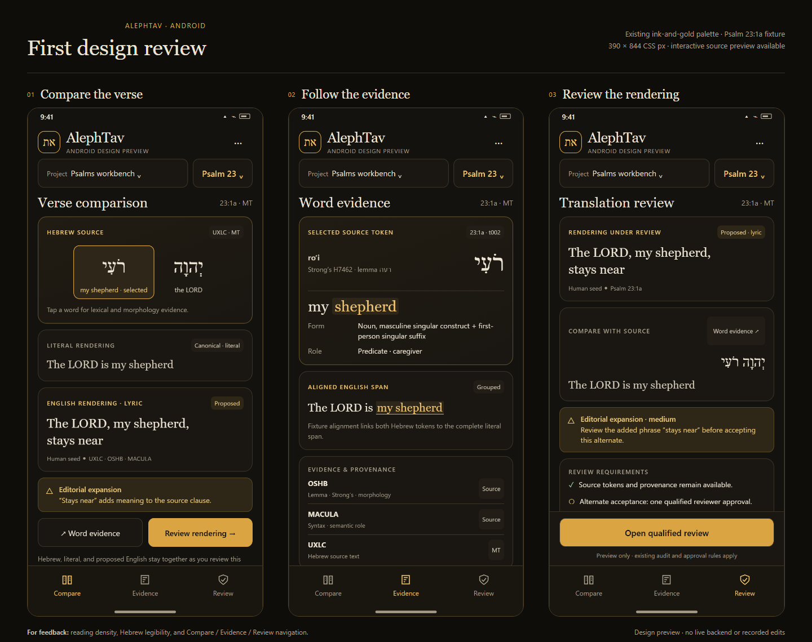

# Android mobile design handoff

Status: **proposal for review, not an approved design or a shipped mobile build**.
Prepared 2026-10-07. The user requested a PR for these designs so implementation can
continue in another session. This directory changes no application behavior,
backend, canonical content, schema, or source corpus.

## Start here



- Open [index.html](index.html) locally for the interactive static proposal. Use
  Compare, Evidence, and Review at the bottom of the screen
- Open [board.html](board.html) for the three-screen comparison board
- [mockups/](mockups/) contains nine phone screenshots: each screen at 360×800,
  390×844, and 412×915 CSS pixels, captured at 2× density
- [mockups/validation.json](mockups/validation.json) records the original static
  mockup browser-emulation checks. File paths have been made repository-relative

The mockup has **no API connection, persistence, or actual review action**.
Preview-only controls explain that limitation. Its fixture text and warnings
illustrate the workflow; the screenshots do not demonstrate backend integration.

## Proposed direction

Preserve the existing warm ink/gold comparison palette, Hebrew typography and
diacritics, English layers, provenance, and reviewer accountability on a phone.

1. **Compare:** keep the selected psalm/clause visible; stack Hebrew, literal,
   and proposed lyric text; show expansion warnings beside the affected text
2. **Evidence:** make token details available by tapping, without requiring hover;
   keep lexical data, morphology, grouped alignment, and source provenance visible
3. **Review:** distinguish a proposed rendering from an accepted alternate or
   canonical text. Keep warnings, rationale, review requirements, and audit history
   available before an action

The proposal uses Psalm 23:1a from the repository's fixture:
Hebrew יְהוָה רֹעִי; canonical literal “The LORD is my shepherd”; proposed lyric
“The LORD, my shepherd, stays near”. The additional phrase is flagged as an
editorial expansion. Token t002 is *ro'i*, Strong's H7462, lemma רעה.
The repository fixture aligns **both Hebrew tokens to the full literal span**;
the highlighted “my shepherd” is a reading aid, not a claim of finer alignment.

## Decisions still open

No design feedback or approval was received before this handoff. The next session
should confirm:

- Reading density and Hebrew/diacritic legibility on an actual Android phone
- Whether Compare / Evidence / Review navigation fits the user's workflow
- Whether the first Android milestone connects to an existing desktop/self-hosted
  backend or must work independently and offline

A responsive React UI is the smallest first step if a backend connection is
acceptable. Standalone/offline Android needs a separate storage/runtime design.
Do not silently choose a native rewrite, APK wrapper, PWA caching model, or remote
deployment before the architecture decision.

## Grounding in the current checkout

Verified checkout: `408e1f3cb32e5be211ea7e51402e5b1da7454a0b` on `main`.
The original mockups were made from public source readings before a full checkout
was available; they are not an exact screenshot of this commit.

Relevant source:

- [App.tsx](../../app/ui/src/app/App.tsx) routes `/workbench` to `ComparisonPage`
- [ComparisonPage.tsx](../../app/ui/src/pages/ComparisonPage.tsx) owns project and
  psalm selection; [TranslationComparisonTable.tsx](../../app/ui/src/components/TranslationComparisonTable.tsx)
  owns the verse accordion and assessment workflow
- [VerseDetail.tsx](../../app/ui/src/components/VerseDetail.tsx),
  [WordSummary.tsx](../../app/ui/src/components/WordSummary.tsx), and
  [VerseStudyDesk.tsx](../../app/ui/src/components/VerseStudyDesk.tsx) are the main
  reading/evidence surfaces
- [styles.css](../../app/ui/src/styles.css) supplies the existing comparison palette
  and responsive rules
- [ingest_service.py](../../app/services/ingest_service.py) contains the illustrated
  Psalm 23 fixture; [REVIEW_POLICY.md](../../docs/REVIEW_POLICY.md) governs approvals

Observed mobile gaps, to verify when implementation resumes:

- Existing ≤720px CSS hides Hebrew and fidelity badges in collapsed verse rows
- Several newer word-summary and arrangement layouts retain desktop-sized columns
- Many controls are smaller than the proposal's 48 CSS-pixel touch target
- Dialogs, long project names, editing with the soft keyboard, repeated navigation,
  and evidence panels need real small-screen regression coverage

A small responsive groundwork experiment was preserved separately as an optional,
unapplied patch. It passed TypeScript/build checks but could not be rendered in the
cloud execution environment. **It is deliberately not part of this design-only PR.**
The implementation session should work from approved design decisions rather than
assume that experiment is validated or required.

## Backend and security constraints

- The FastAPI backend uses local files and SQLite, and Codex/llama integration
  starts native subprocesses; the current app is not a standalone phone runtime
- [vite.config.ts](../../app/ui/vite.config.ts) uses relative API URLs and a
  development-only proxy. `VITE_API_BASE_URL` sets that proxy, not a production
  phone API endpoint. The production base is `/AlephTav/`
- [main.py](../../app/api/main.py) allows wildcard CORS and the routes currently
  have no authentication dependency. **Keep the API loopback-only.** Do not expose
  it directly to a LAN or the public internet just to make a phone connect; design
  and verify authenticated transport before a connected-phone milestone
- Review policy stays authoritative: one qualified approval for an alternate;
  two for canonical promotion/modification; required audit records for mutations
- Never edit `data/raw/`, bypass content validation, weaken schemas, or implement
  review approval as a client-only state change

## Verification record

### Static proposal, original browser-emulation run

All three views at all three phone widths were captured and visually inspected.
Recorded checks show no horizontal overflow, visible controls ≥48 CSS pixels high,
and Hebrew `rtl` direction. This was browser emulation, **not Android hardware**.
During packaging, all ten PNGs passed image-integrity checks, all nine phone
images matched their recorded 2× dimensions, and the source JavaScript passed
`node --check`.

### Untouched application baseline, current cloud checkout

- `npm ci` and `npm run build`: passed (TypeScript + production Vite bundle)
- Python unit, integration, and non-corpus golden tests: **350 passed**
- Content validation: **2,679 files, zero errors**
- Full-corpus audit test: **1 passed**, covering 150 psalms / 2,527 units
- `pip check`: passed
- Protected `content/`, `data/raw/`, and `schemas/` contents remained unchanged

Pre-existing baseline failures are not changed by this proposal:

- Ruff: 202 findings; formatting check: 26 files
- Mypy: 124 errors across 20 files
- The corpus audit report flags 2,356 units for composer-quality heuristics.
  A passing audit test means the report was generated, not that corpus quality
  is clean

### Not verified

Live application visual/Playwright checks, Android hardware, soft-keyboard behavior,
offline/PWA operation, production phone networking, and backend-integrated mobile
review actions were **not run successfully**. Headless Chromium could not create
its process socket in the cloud execution environment; the cloud browser also
rejected the loopback preview URL. No Android-render success is claimed.

The existing E2E suite largely targets the older `WorkbenchPage`, while the current
entry point routes to `ComparisonPage`. Update the selectors/workflows before
treating the legacy suite as coverage of the new mobile comparison experience.

## Continue safely in another session

1. Read [AGENTS.md](../../AGENTS.md) and [CLAUDE.md](../../CLAUDE.md)
2. Review the static proposal and settle the backend/offline decision
3. Keep desktop behavior intact while implementing approved small-screen changes
4. Add regression tests for Hebrew/RTL, visible warnings and provenance, touch
   targets, collapsed/expanded verses, repeat taps, Close/Cancel, Back/Forward,
   keyboard editing, and unchanged review-service enforcement
5. Run the build, content validation, applicable Python tests, and actual UI
   rendering before asking for an Android acceptance check

Use isolated test data. `scripts/bootstrap_fixture_repo.py` replaces content and
reports beneath `ALEPHTAV_ROOT_DIR`; **never run it against the real checkout**.
The current Playwright configuration starts the fixture API on 8765 but Vite's
default proxy points to 43174, so align them when running E2E locally:

```sh
export ALEPHTAV_ROOT_DIR="$(mktemp -d)"
export VITE_API_BASE_URL=http://127.0.0.1:8765
npm run test:e2e
```

The existing [render.mjs](render.mjs) is the original static-mockup renderer. It
expects Node and Windows Chrome at its standard installation path. It creates an
isolated, ignored `render-profile-device/` directory. Use `node render.mjs --all`
from this folder on that supported setup; this script was syntax-checked, not
rerun in the current cloud environment.
